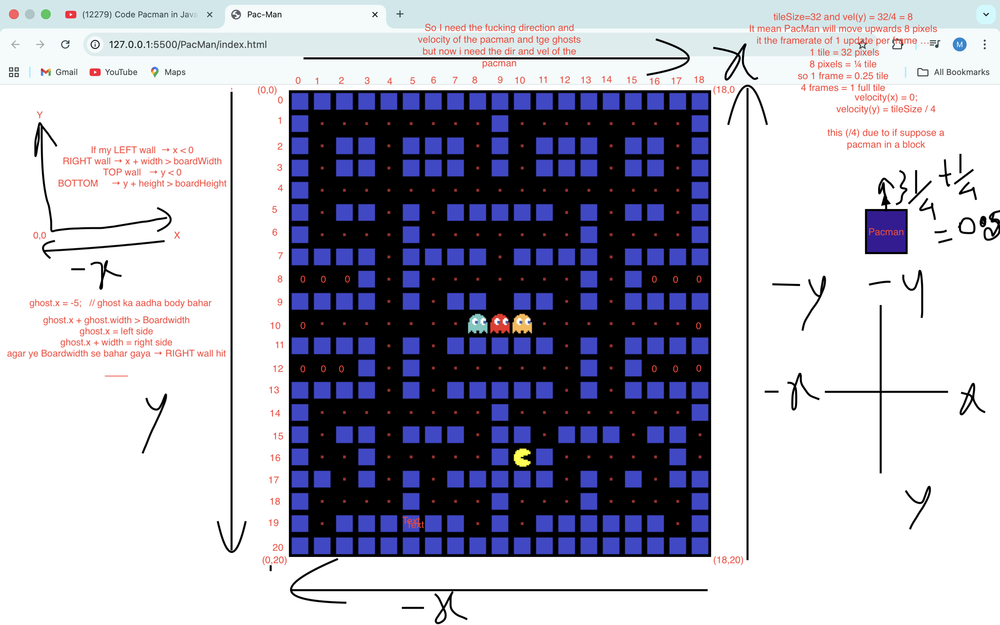
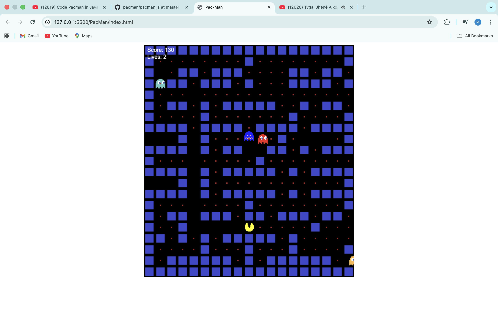

# Pac-Man Game

A classic Pac-Man game implemented in JavaScript using HTML5 Canvas. Navigate Pac-Man through the maze, eat food pellets, avoid ghosts, and achieve the highest score possible.

## Features

- **Game Board**: A 19x21 tile-based maze with walls, food pellets, and spawn points for Pac-Man and ghosts.
- **Pac-Man Movement**: Control Pac-Man using arrow keys or WASD. Pac-Man's image changes based on direction.
- **Ghosts**: Four ghosts (blue, pink, orange, red/scared) with random movement. Ghosts can collide with Pac-Man, reducing lives.
- **Food System**: Brown food pellets that increase the score when eaten.
- **Collision Detection**: Handles collisions between Pac-Man, ghosts, walls, and food.
- **Scoring and Lives**: Track score and lives. Game over when lives reach zero or Pac-Man hits a wall.
- **Restart Mechanism**: Press any key during game over to restart the game.
- **HUD**: Displays score, lives, and temporary key messages.
- **FPS Control**: Runs at 8 FPS for smooth gameplay.

## How to Run

1. Ensure you have the following image files in the same directory as the HTML file:
   - `wall.png`
   - `redGhost.png` (used for pink ghost)
   - `orangeGhost.png`
   - `blueGhost.png`
   - `scaredGhost.png`
   - `pacmanLeft.png`
   - `pacmanRight.png`
   - `pacmanDown.png`
   - `pacmanUp.png`

2. Open [index.html](PacMan/index.html) in a web browser.

3. The game will load automatically.

## Controls

- **Arrow Keys** or **WASD**:
  - Up: Move Pac-Man up
  - Down: Move Pac-Man down
  - Left: Move Pac-Man left
  - Right: Move Pac-Man right

- **Restart**: Press any key when the game is over to restart.

## Game Mechanics

- Pac-Man starts facing right at the designated position in the [tileMap](PacMan/pacman.js).
- Ghosts move randomly and change direction upon hitting walls or the board edges.
- Eating food increases the score by 10 points.
- Colliding with a ghost reduces lives by 1 and resets positions.
- The game ends if Pac-Man hits a wall or runs out of lives.

## Code Structure

- **[index.html](PacMan/index.html)**: Main HTML file with canvas element.
- **[index.css](PacMan/index.css)**: Basic styling for centering and board background.
- **[pacman.js](PacMan/pacman.js)**: Core game logic, including:
  - `Block` class: Represents game entities (Pac-Man, ghosts, walls, food).
  - `loadMap()`: Parses the tile map to create game elements.
  - `update()`: Main game loop for movement and drawing.
  - `move()`: Handles movement and collisions.
  - `draw()`: Renders the game on the canvas.
  - `movePacman()`: Event handler for keyboard input.
  - `collision()`: Detects rectangle collisions.

## Screenshots

(Add screenshots here if available. For example:)

## Dependencies

- None. Runs directly in modern web browsers supporting HTML5 Canvas.

## Credits

- Inspired by the original Pac-Man arcade game.
- Images: Ensure you have the required PNG files (not included in the repository).
- Collision detection formula sourced from standard rectangle collision algorithms.